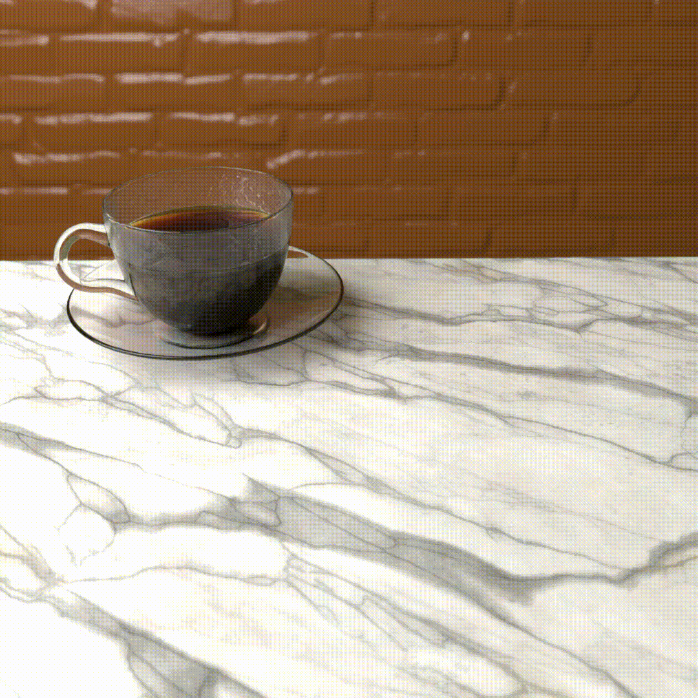

The donut in the header is my attempt to animate a donut in Blender, following the tutorial by [&#x21B7;Blender Guru](https://www.blenderguru.com/tutorials/2022/1/27/how-to-use-blender). Here's the finished product:

  
(Note: if the rendering quality is odd, open the image itself in a new tab; I haven't figured out how to rescale it properly while embedded)
