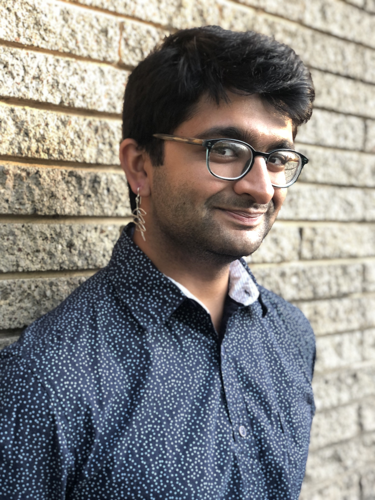

# Contact Info

[Work Message](https://docs.google.com/forms/d/e/1FAIpQLSftPbasi-MWPYgw60U6WxMLNv4Kl1PuiOK2pRLTq30Au4yevw/viewform?usp=sf_link) | [Personal Message](https://docs.google.com/forms/d/e/1FAIpQLSfZYKXpQ05JjhMZjeAKn2WVTH5-M_zR_uot5u0m9_4SOLlsSA/viewform?usp=sf_link)  
Office: JWB 121

My current students are probably looking for the information [here](#teaching).

---

Welcome to [my](aboutme.html) site! I use this space to organize my personal and professional life.

  
(Photo credit: Yasi Shaker)

I am a queer mathematician, musician, activist, and dancer interested in building community and expanding networks. I subscribe strongly to the axioms of mathematics posited by [&#x21B7;Dr. Federico Ardila](https://fardila.com) and restate them here...

* Axiom 1. Mathematical potential is equally present in different groups, irrespective of geographic, demographic, and economic boundaries.
* Axiom 2. Everyone can have joyful, meaningful, and empowering mathematical experiences.
* Axiom 3. Mathematics is a powerful, malleable tool that can be shaped and used differently by various communities to serve their needs.
* Axiom 4. Every student deserves to be treated with dignity and respect.

...as well as the statement proceeding these axioms: "These statements should not sound revolutionary, and considering the current practices of the mathematical society, they are a pressing call to action."

---

# Mathematics

## Teaching

### Current courses

* Summer 2024 - [&#x21B7;pre-REU: Expanding circle maps, digit expansions and topological Markov chains](https://www.math.utah.edu/~vinhage/prereu24/materials/)

### Previous courses

* Spring 2024 - University of Utah MATH 2210: [Syllabus](assets/pdf/2024_2210_syllabus.pdf)
* Summer 2023 - University of Utah MATH 3210: [Syllabus](assets/pdf/2023_3210_syllabus.pdf)
* Spring 2023 - University of Utah MATH 1320
* Fall 2022 - University of Utah MATH 1320

## Research

My interests are in number theory, arithmetic geometry, and representation theory. I am currently a graduate student at the University of Utah working with [&#x21B7;Dr. Sean Howe](https://www.math.utah.edu/~howe/) and [&#x21B7;Dr. Gordan Savin](https://www.math.utah.edu/~savin/). Further details TBD.

## Notes / Code / Etc.

### Textbook Solutions

For all of this source code (tex files), see [&#x21B7;this repo](https://github.com/abhayg11/abhayg11.github.io/tree/main/assets/tex/).
* Bump - Automorphic Forms and Representations: [Chapter 4](assets/tex/bump/Chapter4.pdf)
* Hartshorne - Algebraic Geometry: [Chapter 2](assets/tex/hartshorne/Chapter2.pdf)
* Marcus - Number Fields: [Chapter 1](assets/tex/marcus/Chapter1.pdf) \| [Chapter 2](assets/tex/marcus/Chapter2.pdf) \| [Chapter 3](assets/tex/marcus/Chapter3.pdf)
* Milne - Algebraic Number Theory: [Solutions](assets/tex/milne_ant/Solutions.pdf)
* Qing Liu - Algebraic Geometry and Arithmetic Curves: [Chapter 1](assets/tex/qingliu/Chapter1.pdf) \| [Chapter 2](assets/tex/qingliu/Chapter2.pdf)
* Vakil - The Rising Sea: [Solutions](assets/tex/risingsea/main.pdf)

### Macaulay2

* [Hello, World!](macaulay2/helloworld.html)

### Other

* [PAWS 2023](assets/tex/paws23/)
* [PCMI 2022](pcmi22/)

---

# Personal

When I'm not doing mathematics, I enjoy...
* Dancing
	- Living Traditions 2023: [&#x21B7;Remix](https://youtu.be/eMaFJ0GUA7Y) \| [&#x21B7;Live dhol](https://youtu.be/Y2OWHEJIoe4)
* Animation
	- [Blender Donut](animation/donut.html)
* Playing music
    - [Santur](music/santur.html)
    - [Dhol](music/dhol.html)
    - [Ukulele](music/ukulele.html)
    - Harmonica
* Playing games. Honorable mentions:
    - Chess
    - Factorio
    - Spirit Island
    - Minecraft
    - Backgammon
* Listening to podcasts
* Gardening
* Reading
* Programming
	- Puzzles
	- Projects
* Other artwork
    - [Crochet](art/crochet.html)
	- Sketching
