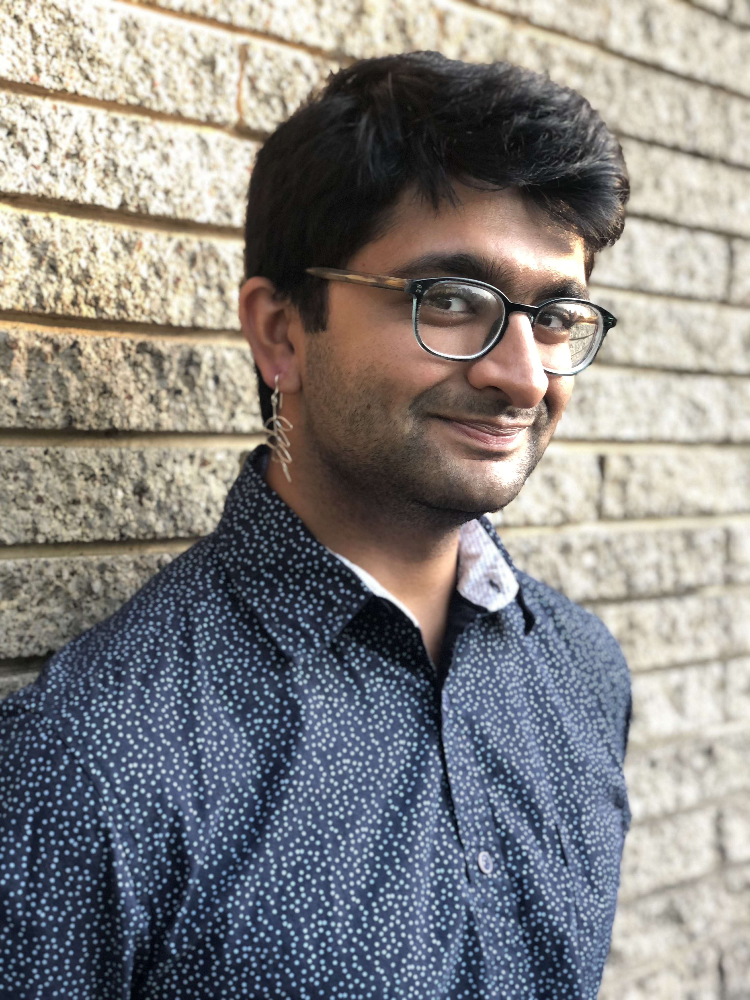

Welcome to my site! I use this space to organize my personal and professional life.

  
(Photo credit: Yasi Shaker)

I am a mathematician, musician, activist, and dancer interested in building community and expanding networks. I subscribe strongly to the axioms of mathematics posited by [Dr. Federico Ardila](https://fardila.com) and restate them here...

* Axiom 1. Mathematical potential is equally present in different groups, irrespective of geographic, demographic, and economic boundaries.
* Axiom 2. Everyone can have joyful, meaningful, and empowering mathematical experiences.
* Axiom 3. Mathematics is a powerful, malleable tool that can be shaped and used differently by various communities to serve their needs.
* Axiom 4. Every student deserves to be treated with dignity and respect.

...as well as the statement proceeding these axioms: "These statements should not sound revolutionary, and considering the current practices of the mathematical society, they are a pressing call to action."

# Professional

## Mathematics

* [Teaching](teaching/)
* [Research](research/)
* [Coursework](coursework/)

## Other

* [Curriculum Vitae](cv/)

---

# Personal

## Animation

* [Blender Donut](animation/donut.md)

## Music

* [Santur](music/santur.md)
* [Dhol](music/dhol.md)
* [Ukulele](music/ukulele.md)
* [Harmonica](music/harmonica.md)

## Dancing

TBD

## Programming

* Puzzles
* Projects
* Math